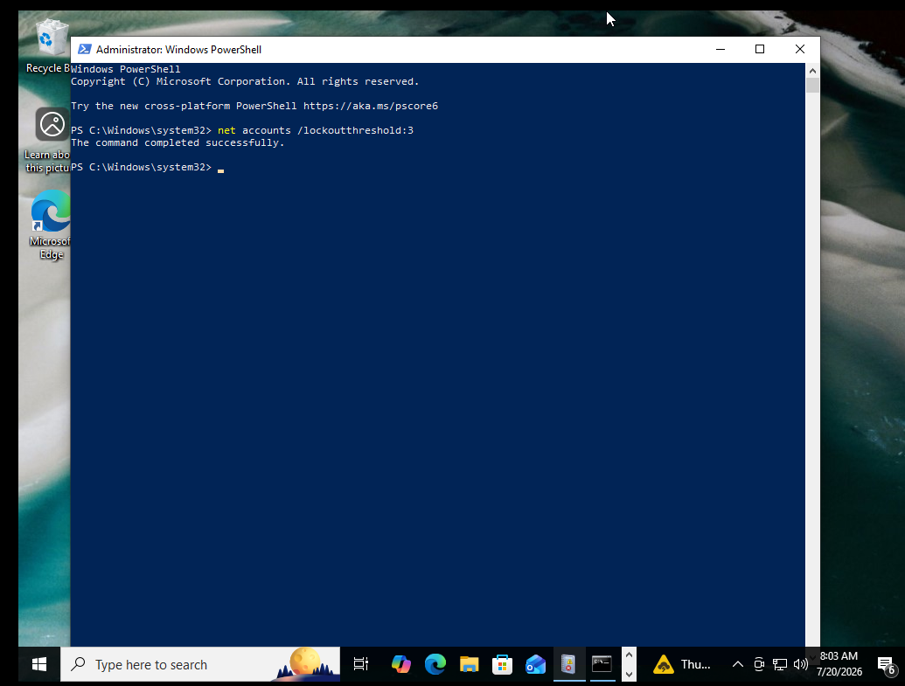
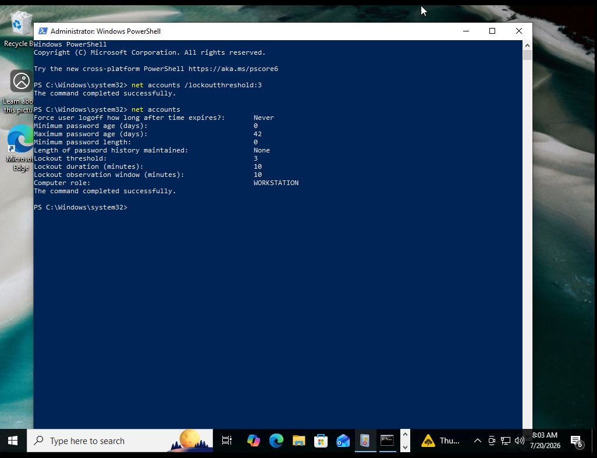
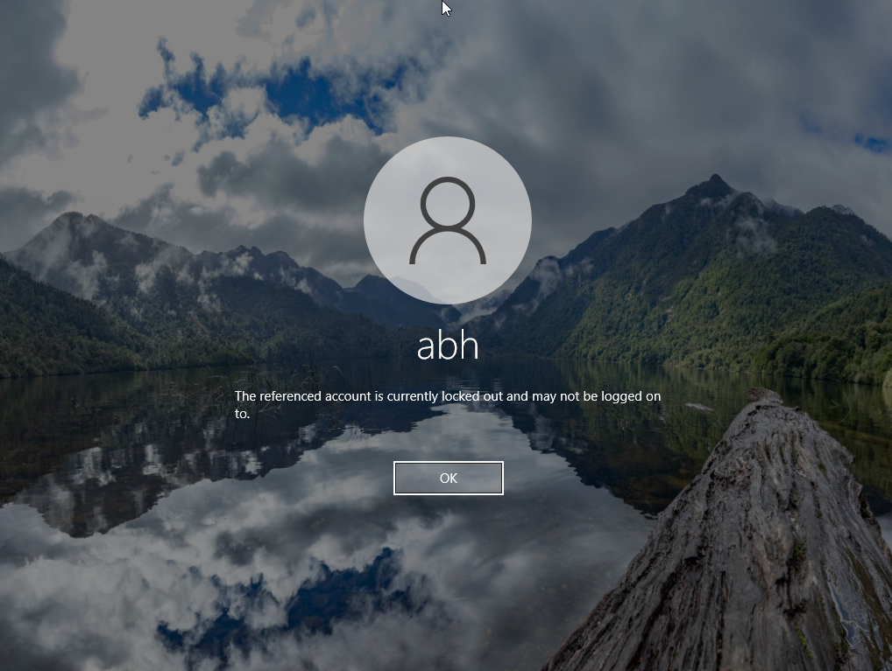
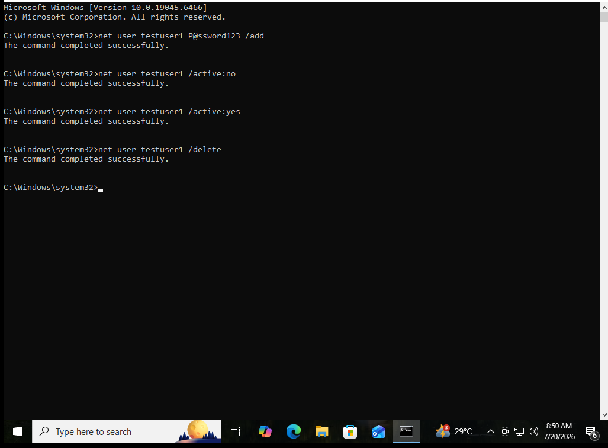
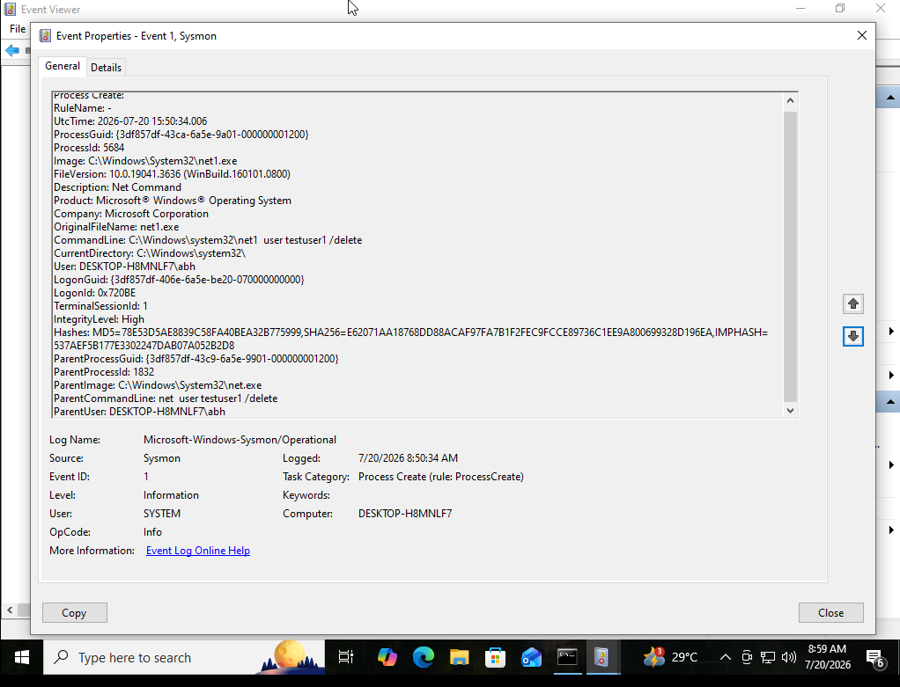
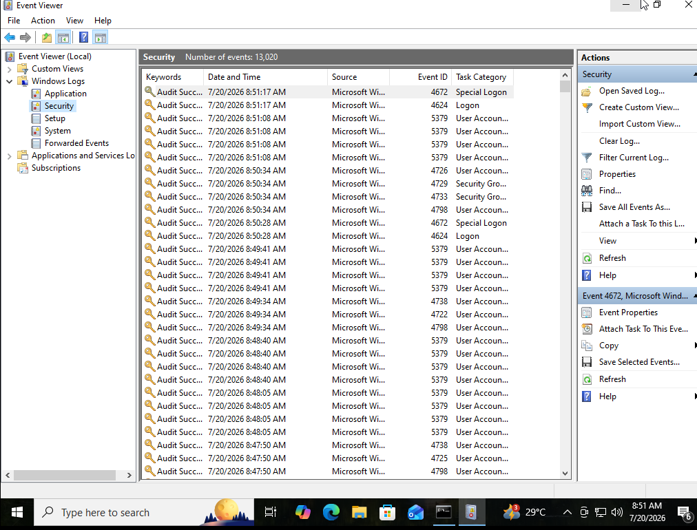
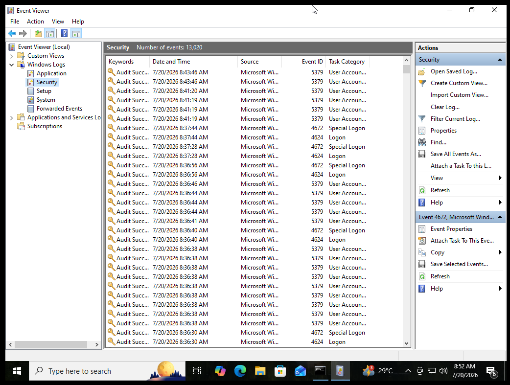
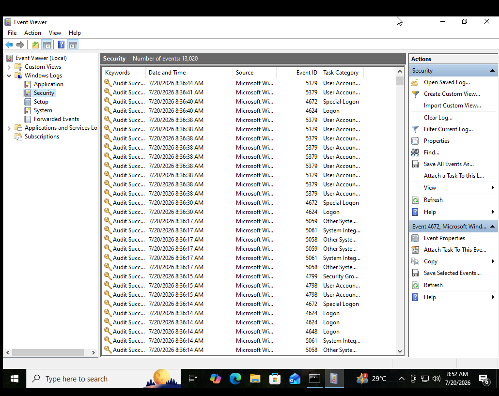
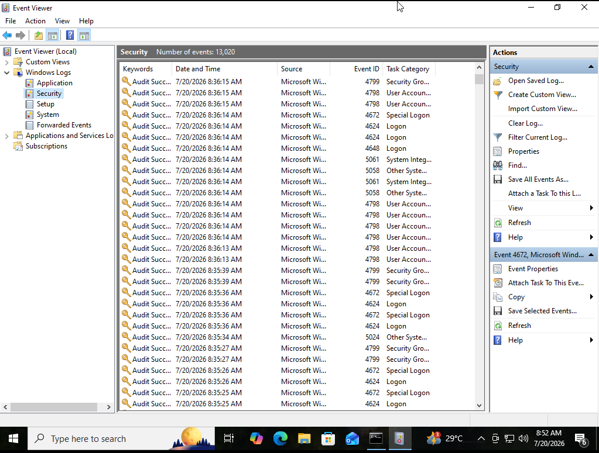
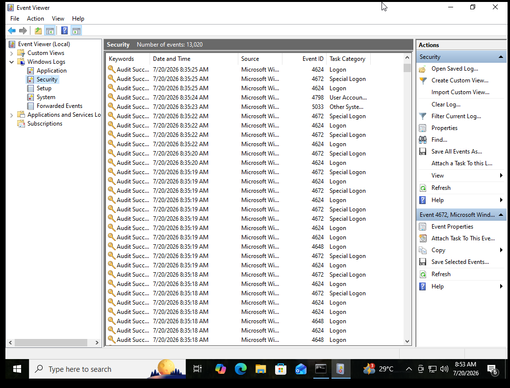

# Windows Event Monitoring Lab

Hands-on SOC (Security Operations Center) style lab to learn how analysts investigate Windows endpoint activity using native **Event Viewer (Security log)** and **Sysmon**. This lab covers authentication events, account lockouts, and full account lifecycle tracking, with process-level correlation via Sysmon.

## Objective

Learn how a SOC analyst investigates security-relevant activity on a Windows machine by:
- Generating and identifying successful/failed logon events
- Triggering and analyzing an account lockout
- Tracking a user account through its full lifecycle (create → disable → enable → delete)
- Correlating Security log events with Sysmon process-creation telemetry

## Tools Used

- Windows 10 Virtual Machine (standalone/isolated)
- Event Viewer (`eventvwr.msc`)
- Sysmon (Sysinternals) — installed with the [SwiftOnSecurity](https://github.com/SwiftOnSecurity/sysmon-config) community config
- Windows PowerShell / Command Prompt (Administrator)

## Sysmon Installation

Sysmon64.exe was downloaded from Microsoft Sysinternals, and `sysmonconfig-export.xml` was downloaded from the SwiftOnSecurity GitHub repo. Both files were placed in the same folder and installed with:

```powershell
cd C:\Sysmon
.\sysmon64.exe -accepteula -i sysmonconfig-export.xml
```

Logs then began populating under:
```
Applications and Services Logs > Microsoft > Windows > Sysmon > Operational
```

## Key Event IDs Investigated

| Event ID | Source | Meaning |
|---|---|---|
| 4624 | Security | Successful logon |
| 4625 | Security | Failed logon |
| 4740 | Security | Account locked out |
| 4720 | Security | User account created |
| 4722 | Security | User account enabled |
| 4738 | Security | User account changed (e.g. disabled) |
| 4726 | Security | User account deleted |
| 4672 | Security | Special logon (admin privileges assigned) |
| 5379 | Security | Credential Manager credentials read |
| 1 | Sysmon | Process creation |

## Lab Walkthrough

### 1. Configure Account Lockout Policy

Set the lockout threshold to 3 invalid attempts using an elevated PowerShell session:

```powershell
net accounts /lockoutthreshold:3
```



Verified with `net accounts` — Lockout threshold: 3, Lockout duration: 10 min, Observation window: 10 min:



### 2. Trigger Account Lockout (Event ID 4740)

After 3 consecutive wrong-password attempts at the lock screen, the account `abh` was locked out by Windows:



> This generates **Event ID 4740** in the Security log, recording the locked account name, the caller computer name, and the timestamp — allowing an analyst to trace the lockout back to the preceding chain of 4625 (failed logon) events.

### 3. Account Lifecycle Tracking (Create → Disable → Enable → Delete)

A test account was created, disabled, re-enabled, and deleted from an elevated Command Prompt:

```cmd
net user testuser1 P@ssword123 /add
net user testuser1 /active:no
net user testuser1 /active:yes
net user testuser1 /delete
```



Each command generates a corresponding Security log event: **4720** (created), **4738** (disabled), **4722** (enabled), **4726** (deleted).

### 4. Sysmon Cross-Correlation (Event ID 1 — Process Create)

Sysmon's Process Create events were reviewed to see exactly which process executed the account changes, its parent process, command line, and file hashes:



This confirms the process ancestry: `cmd.exe`/`PowerShell` → `net.exe` → `net1.exe`, along with MD5/SHA256/IMPHASH values of the binary — data an analyst uses to confirm the executable is the legitimate Windows `net.exe` and not a masquerading tool.

### 5. General Security Log Review

The Security log accumulated 13,000+ events during the lab. General review showed a mix of expected events: 4624/4672 (logon/special logon), 5379 (Credential Manager), 4798/4799 (user/group enumeration), and 5058/5061 (cryptographic key operations).







## Timeline Summary

| Event ID | Category | Description |
|---|---|---|
| 4625 | Logon | Failed logon attempts (wrong password) at lock screen |
| 4740 | Account Management | Account `abh` locked out after 3 failed attempts |
| 4624 | Logon | Successful logon after correct password/unlock |
| 4720 | Account Management | `testuser1` account created |
| 4738 | Account Management | `testuser1` disabled |
| 4722 | Account Management | `testuser1` re-enabled |
| 4726 | Account Management | `testuser1` deleted |
| Sysmon 1 | Process Create | `net.exe`/`net1.exe` process chain observed for each account command |

## Conclusion

This lab demonstrated the core SOC investigation workflow on a Windows endpoint: configuring audit policy, generating and identifying authentication events, observing an account lockout triggered by repeated failed logons, tracking the full lifecycle of a user account, and cross-referencing Security log events with Sysmon process-creation telemetry for deeper process-level context. Together, these logs let an analyst reconstruct an accurate timeline of activity on an endpoint — a foundational skill for incident investigation and threat hunting.

## Repository Structure

```
windows-event-monitoring-lab/
├── README.md
└── screenshots/
    ├── 01-lockout-threshold-set.png
    ├── 02-lockout-policy-verified.png
    ├── 03-account-locked-screen.png
    ├── 04-account-lifecycle-cmd.png
    ├── 05-security-log-4624-4672.png
    ├── 06-security-log-overview.png
    ├── 07-security-log-5379-5061.png
    ├── 08-security-log-4799-5058.png
    ├── 09-security-log-5033-4798.png
    └── 10-sysmon-event1-process-create.png
```
